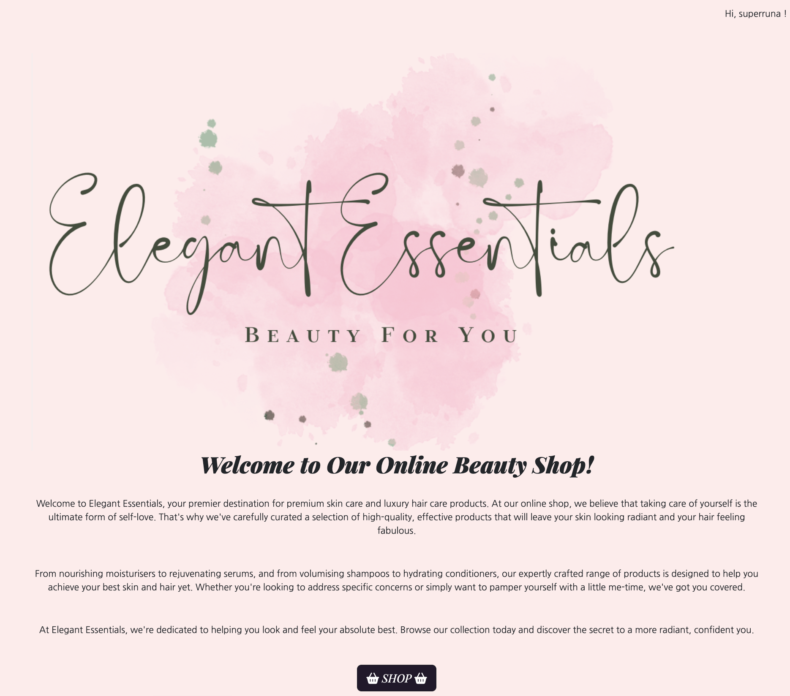
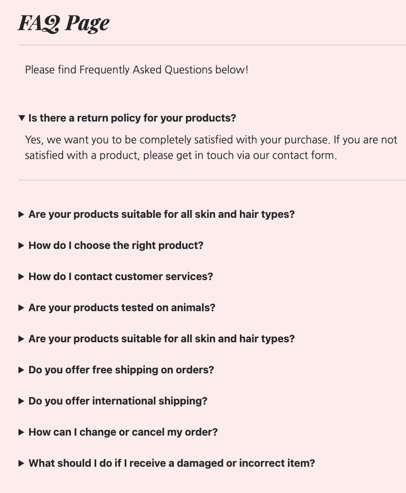

<h1 align=center>Portfolio Project 5</h1>

<h2 align=center>Elegant Essentials</h2>

## FINAL DESIGN
 [Am I Responsive](https://amiresponsive.co.uk/)

[Please follow this link to view the final project](https://elegant-essentials-1b55310ae644.herokuapp.com/shop/)

#

## IMPORTANT NOTE

When testing this website, please use fictional payment cards.

The cards used for testing purposes were taken from the Stripe website, which is the provider of the payment system that was used when developing this project.

| Card Type | Card Number | Action |
| ---- | ---- | ---- | 
| Valid card | 4242 4242 4242 4242 | payment successful |
| Generic decline	            | 4000 0025 0000 3155 |	payment successful, authorisation required |
| Insufficient funds decline	| 4000 0000 0000 9995	| card_declined	| 

When using above cards, please enter a fictional expiry date which must be in the future (MM/YY), as well as a fictional 3-digit CVC and a random 5-digit postal code (numbers only).

Further test card numbers can be found in the [Stripe docs](https://docs.stripe.com/testing?locale=en-GB).

#

## PROJECT IDEA

My idea for this project stems from my PP4, which I developed a spa website for. I wanted to create a B2C e-commerce project based on a similar idea and have decided on an online beauty shop. 
The website offers a selection of products and features, such as buying beauty products, leaving reviews for the shop, signing up to a newsletter service, contacting the shop via a conatct form and more.

When planning the project the most important features to me were:

1. Welcoming homepage
2. Good selection of products
3. User-friendly interface
4. Product descriptions and interesting product images
5. Simple design to allow users to navigate the website seamlessly
6. Search functionality to help users find products easily
7. Contact form for customers
8. Search bar to allow customers to find certain products quickly

#

## UX / UI

### OVERVIEW

- The website was created using Django and features CRUD (Create, Read, Update, Delete) functionality and a user-friendly UI to make buying products from the website sraightforward.
The overall navigation is easy to use and simple to understand so users can find anything they are looking for quickly.
- The user can sign up to the website and when logged in, they can buy products from the shop, leave reviews, as well as edit and delete these.
All other functionalities (e.g. contacting the store and reading reviews from authorised users) are accessible by all site users not matter if they have an account or not.
- Logged-in users can see their past orders and default profile (shipping) information.
The overview of past orders placed has a clickable order number that opens a past order confirmation page, so the user can see where the particular order was shipped to and what phone number was given for the order when it was placed.
- Admin users have extra functionality in the admin panel, being able to search orders by date and username. They can also approve reviews that users have written, so they become visible on the website for everyone to read. Admins can delete orders and user profiles, add questions and answers to the FAQ page and add more products to the website store or delete products if required.
Furthermore, they can view contact requests that might have been sent to the store.

#

### User Stories

To plan the User Stories for this project I have created a Kanban board in Github which can be viewed [here](https://github.com/users/runabrandes/projects/4).

**Agile Methodology** was used throughout the project and "issues" moved on the Kanban board according to what was being worked on at the time. As user stories were accomplished, they were moved in the GitHub Kanban board from **ToDo**, to **In Progress** to **Done**. A row for **Future Implementations** was added as well, which currently holds 3 items, that are not yet implemented but would be beneficial features the website could have in the future.
**MoSCoW** was also used for this project to help prioritise implementation of features.

#

### Strategy

#### Project Setup

- Django Application: Create the initial Django application tailored for Elegant Essentials.
- File Structure: Organise the project files to ensure maintainability.
- Database Models: Define and establish models to capture relevant data.
- Static Files: Link custom CSS files and images for a polished look.
- Base Template: Create a base.html file for consistent layout across all sites.
- Google Fonts: Integrate Google Fonts for enhanced typography.

#### UX Enhancements
- Favicon: Add a Favicon logo for brand recognition.
- Product Listings in Shop: Display inviting images of products, featuring a  description and their cost.
- Styled Auth Pages: Customise the default allauth pages to reflect the website's overall styling.
- Home Page: Create an inviting homepage showcasing the shop's introduction so customers knwo what the website offers right away.
- Shop Button on Home Page: So users can access the shop immediately and don't have to search for it.
- Order History: Allow users to view past orders and past information.
- User Notifications: Display alerts and messages to inform users about statuses of relevant sections.

#### Navigation
- Navbar: Ensure an easy to use navigation bar across all relevant pages for easy access to different sites.
- Footer: Implement a standard footer on all pages for additional information (privacy policy), newsletter signup link and social media link (Facebook).

#### CRUD
- CRUD was implemented for the reviews section featured in the Elegant Essentials project
- Users that are logged into their existing and verified profile can write reviews. These require to be authorised prior to them being visible to other users. 
- Logged in users can also update and delete their reviews as desired. 
- When a user decides to update their review, authorisation by an admin is required again before the updated review is visible to other users. 

#### Authentication
- User Accounts: Enable users to create and manage their personal account information.
- Allauth Setup: Configure Django Allauth for robust user authentication.

#### Validation
- Form Validation: For all forms across the website to prevent faulty orders being placed. 
- Ensure only the user who placed an order can view their past confirmation. Assign orders to the logged in user profile.

#### Administration
- Admin Search: Allow admins to search and filter orders.
- User Account Management: Let users update their account details.
- Review Authorisation: Equip admins with tools in the admin panel so they can confirm reviews.

#### Deployment
- Amazon Web Services (AWS) for Media and Static.
- PostgreSQL: for Database services. 
- Heroku Deployment: Deploy the application on Heroku.
- DEBUG Settings: Ensure the application is deployed with DEBUG set to False.

#### Testing
- Testing: Conduct thorough testing to ensure a smooth user experience and validate code (HTML and CSS validator, Python Linter, WAVE testing).

#### Documentation
- README: Create comprehensive documentation to guide in navigating and using the application as well as explaining the purpose of the website. 
- Testing: Create comprehensive documentation (TESTING.md) showcasing the different testing approaches. 

#

### Scope

#### Simple and Intuitive UX

- Create a responsive navigation bar for easy access to all pages.
- Develop a footer with social media links and privacy policy and newsletter signup link (button).
- Focus on inviting design for shop products to make users interested in browsing the shop.
- Ensure that users receive visual notifications (alerts or redirects to confirmation pages) for all actions they undertake, such as placing orders, signing up to the newsletter, leaving a review.
- Maintain user orientation throughout their website experience, enhancing usability.
This is achieved by using similar styling and colour schemes throughout the website. 

#### Relevant Content

- Ensure all available products are clearly listed on the site.
- Write informative product descriptions and add clear product images.
- Implement an easy to understad checkout page and checkout process.
- Offer a contact page for users in case they have requests or questions.
- Add a FAQ page with helpful questions and answers so users can find help quickly.
- Allow users to leave reviews so they can share their feedback with other users as well as the site admins so possible issues can be resolved / highlighted.

#### Responsiveness

- Create a responsive website that functions seamlessly across all devices and screen sizes.

#

### Website Structure

The website is designed with the user in mind, the goal being to make the website attractive to potential customers. Users that have not signed up / logged in have access to:
- Home
- Shop 
- Product Descriptions (unable to add items to basket)
- Create Account
- Account Login
- Reviews
- Contact Us
- FAQs page
- Newsletter sign-up page

Once users are logged in, they have access to:
- Home
- Shop
- Product Descriptions
- Checkout
- Profile and past order overview
- Account Logout
- Leave a Review
- Reviews
- Contact Us
- FAQs page
- Newsletter sign-up page

#

### Wireframes

The website layout has been planned through the creation of detailed wireframes that outline the desired structure of the Elegant Essentials website. These wireframes serve as a visual guide, illustrating the placement of key elements on all the pages.

All wireframes can be viewed [here](WIREFRAMES.md).

#

### Features

#### Navigation

The navbar along the top of the pages is always displayed, allowing the user to easily navigate around the site. The styling is consistent across the different pages but has different links on display depending on if users are logged in or out. 

#### Footer

The footer displays on most pages of the webiste and has been styled consistently.
It features a link to the Privacy Policy for Elegant Essentials, a social media link (Facebook), as well as a button link for the Newsletter sign-up page.

#### Logo, Introduction text and Welcome message

The logo of the website has been designed with a simple, cursive style that gives it a unique look, and it also features a short slogan. When users log in, they see a welcoming message, and if they are not logged in, a message stating "You are not logged in!" appears, making it clear whether they have access to personalised features. This straightforward approach helps users understand their status on the site.
An introductory text makes the purpose of the website clear to the users. 

#### Shop

In the shop, users can view the selection of all products the online store offers.  
The product cards hold an image, the name of the product as well as the price.
Users can filter products by "all products", "hair products" or "skin products" and also order these categories by price ascending or price descending.

#### Product Description

The product description pages can be reached by clicking a product card on the shop page.  
The description informs users about uses and benefits of the product they have selected, shows them the price of the product and gives them the option to add different quantities of the product to their bag. In order for the user to add products to their bag they need to be logged in.  

#### Bag

On the bag page the user can see which products they have currently in their bag and what quantity of the products they have added to their bag.
The user can also update the quantity of products in their bag as well as fully delete them. 

#### Checkout

When users are happy with their selection of products, they can progress to the checkout page where they will be asked for their name and email address, as well as shipping information and a phone number, and they can input card details to pay for the products they would like to purchase. They are given an option to save their details to their profile to allow for a faster checkout next time.

#### Order Confirmation

Once the user has entered all relevant checkout details and their payment was successful, they are redirected to an order confirmation page which gives them an overview of the products and the quantity of the products they have purchased, as well as their personal information and the total cost of the products they have purchased. 

#### Profile

On the Profile page, users can view and update their personal information for a faster checkout process, as well as view past orders they have placed. By clicking the order number of a past order, they will be redirected to the order confirmation page that would've been generated at the time the order was made.

#### Contact Us

The website offers a Contact Us page where users have the possibility to fill in a form with their name, email address, as well as a message. Should they have any requests, they can direct it to the site owners via this form. This feature is available to all users.

#### FAQ page

A FAQ page is available to all users, which hold questions and answer to the most frequently asked questions users might have This feature was implemented so users can find help with possible questions quickly rather than having to wait for a response if not required.

#### Leave a Review

Logged-in users can leave a review for the shop so they can share their experiences with other users. When a review is submitted, it requires authorisation by an admin prior to the review being visible to every site user. Logged-in users have the possibility to delete, as well as edit their reviews. If they decide to edit a review which had already been authorised by an admin, then the review requires authorisation again after it has been updated.

#### Reviews

The reviews page is accessible to every site user no matter if they have an account or not. Here they can read reviews that have been left by logged-in users.

#### Sign Up, Sign In, Sign Out

The website provides sign up, sign in and sign out features as well as 'Forgot Password' and email address change options for enhanced security.   Users can create an account to access features that are not accessible for logged-out users. For more information on which pages are acessible by users that are logged-out or logged-in, please check the Website Structre section in this README document.

#### Colour schemes and fonts

The four main colours used across the website are:  
- '#FFEBEB' - Misty Rose, main background colour
- '#23192B' - Dark Purple, colour of buttons
- '#F8F9FA' - Sea Salt, header and footer background colours
- '212529' - Eerie Black - for fonts and icons used across the different pages

Two Google fonts were used:
- 'Playfair Display'
- 'Nanum Gothic'

#### Admin panel

The website features a standard Django admin panel. 
Here, superusers can view information regarding accounts that have been created for the website and add products to the shop and add questions and answers to the FAQ page.  
They can see orders that have been placed by different users, as well as contact requests that might have been made, and read and authorise reviews that were submitted for autorisation. Admins can also see who has signed up to receive the shop's newsletter.
Search and filter functions are present for the different sections to make navigating around the admin panel seamless.

#### Future Features

- Add a wishlist function so users can save products they might want to purchase at a later date.
- Add a live chat function so users can get in touch with the shop faster if they should need help.
- Add product reviews / ratings so users can immediately see how satisfied other users were with the products offered.
- Add a product management page so admins can add, edit and delete products without having to access the admin panel.

#

### Database Schema

A database schema was created for this project's models.
To create this [Lucidchart](https://lucid.app/documents#/home?folder_id=recent) was used.

#

### SEO and Web Marketing Strategy

#### SEO

To find the best Search Engine Optimisation (SEO) keywords I started by brain storming keywords that fit the Elegant Essentials website best. I came up with several keywords as well as keyword phrases for the website:

- Premium haircare 
- Premium skincare
- Skincare
- Haircare
- Beauty 
- Beauty products 
- Sustainable beauty products
- Beauty gifts 
- Online beauty shop
- Natural beauty products 
- Pampering beauty products
- Luxury skincare
- Luxury haircare
- Rejuvenating serums
- Hydrating care
- High quality beauty products 

After the brain storming activity I entered the keywords and phrases into Google and checked what the auto-suggestion function returned.  
These were some of the results:

- Premium haircare - "best premium haircare brands", "premium haircare tips"
- Premium skincare - "top premium skincare products", "premium skincare routine"
- Skincare - "skincare tips", "effective products for skin issues"
- Haircare - "best haircare products", "natural haircare routine"
- Beauty - "latest beauty trends", "beauty hacks"
- Beauty products - "best beauty products for oily skin", "affordable beauty products"
- Sustainable beauty products - "best sustainable beauty brands", "eco-friendly beauty products"
- Beauty gifts - "popular beauty gifts", "beauty gift sets for her"
- Online beauty shop - "best online beauty shops", "discount online beauty products"
- Natural beauty products - "top natural beauty brands", "DIY natural beauty products"
- Pampering beauty products - "luxurious pampering beauty products", "self-care pampering ideas"
- Luxury skincare - "top luxury skincare brands", "luxury skincare for aging skin"
- Luxury haircare - "best luxury haircare products", "luxury haircare routine"
- Rejuvenating serums - "best rejuvenating serums", "rejuvenating serums for aging skin"
- Hydrating care - "best hydrating skincare products", "hydrating care for dry skin"
- High quality beauty products - "high quality beauty products for sensitive skin", "top rated high quality beauty brands"

I then input the keywords into [wordtracker](wordtracker.com) to check for competition on these keywords and based on the results I chose the following keywords for my wesbite which I included in several section of my website as well as in the `meta` keywords tag:

1. Premium haircare
2. Luxury skincare
3. Natural beauty products
4. Hydrating care
5. Beauty gifts
6. Sustainable beauty products
7. Pampering beauty products
8. Beauty products
9. Online beauty shop
10. High quality beauty products
11. Rejuvenating serums
12. Skincare
13. Haircare
14. Premium skin care products
15. Effective products for skin issues
16. Sustainable products
17. Luxury skincare for aging skin
18. Top rated high quality beauty brands
19. Rejuvenating serums for aging skin
20. Best luxury haircare products

#### Web Marketing Strategy