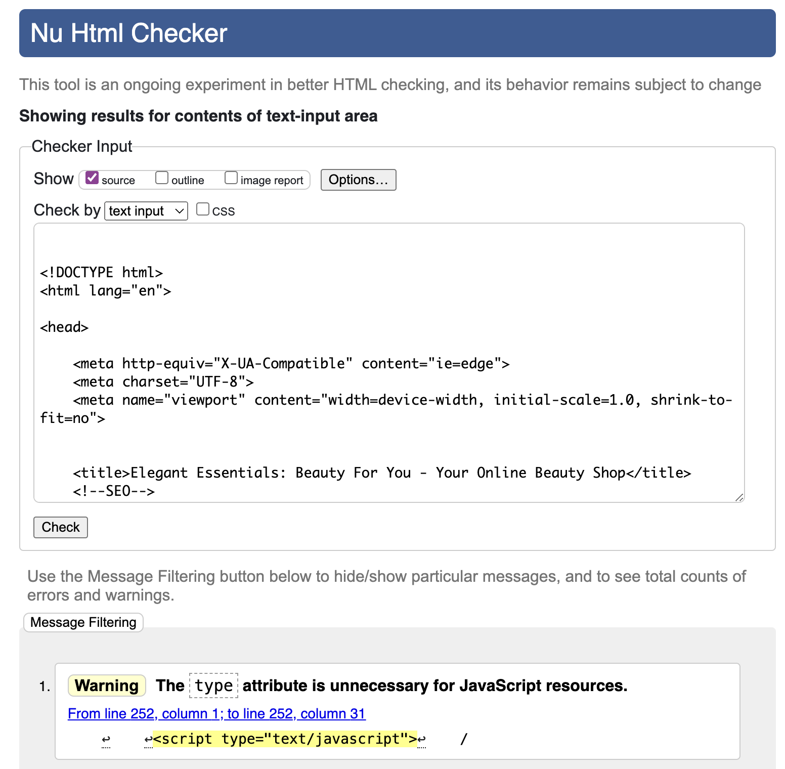
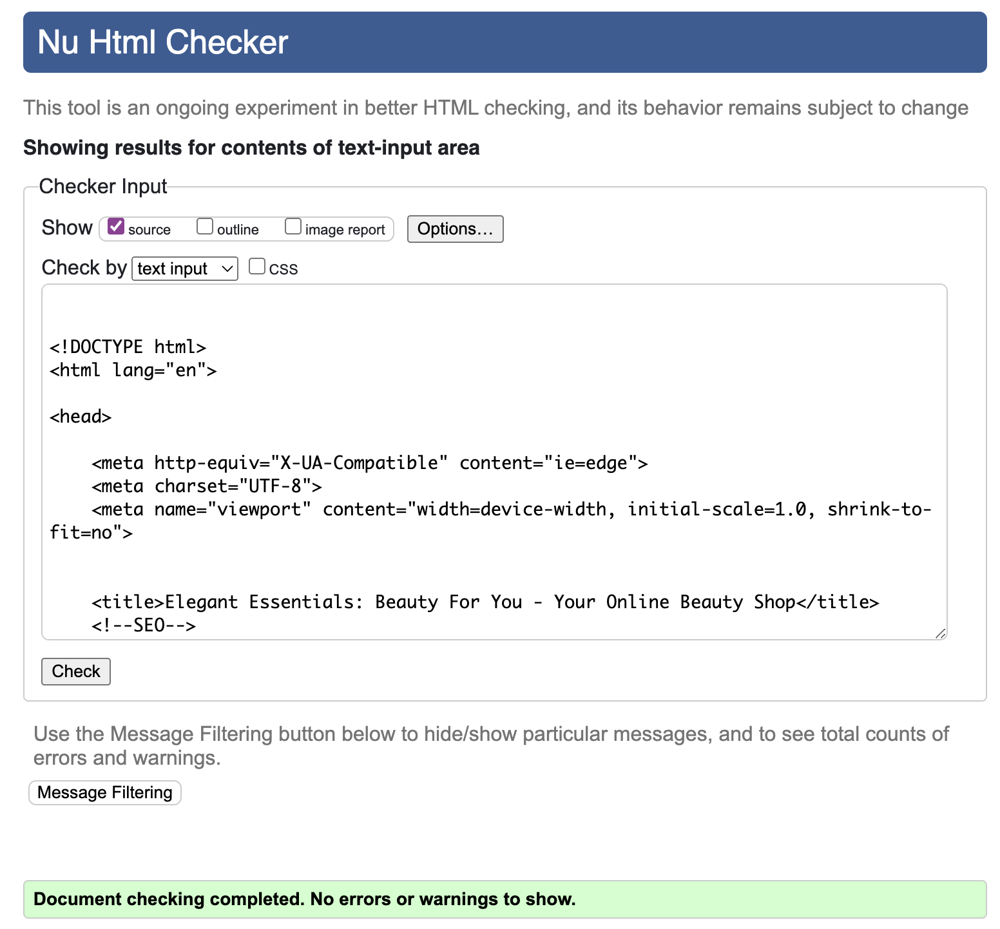

# TESTING

## MANUAL TESTING

### USER STORY: Deployed website

Description:
- The user can view the deployed site

Steps:
1. Go to [the deployed site](https://elegant-essentials-1b55310ae644.herokuapp.com/)
2. View the site

Expected:
- Site loads without errors

Actual:
- As expected

### USER STORY: Navbar

Description:
- A Navbar is displayed to users across all pages

Steps:
1. View all pages
2. Check Navbar is on display
3. Check all Navbar links work

Expected:
- Navbar is always on display
- The Elegant Essentials logo takes the user to the home page when clicked
- Shop takes the user to the shop page
- My profile takes the user to their personal profile (when logged in)
- 'Leave a review' takes the user to the 'leave a review' page (when logged in)
- Reviews takes users to the Reviews page
- Contact Us takes the user to the contact form
- FAQs takes the user to the FAQs page
- Create Account takes the user to the sign up page (when logged out)
- Account Login takes the user to the sign up page (when logged out)
- Account Logout takes the user to the sign out page (when logged in)

Actual:
- As expected

### USER STORY: Footer

Description:
- A footer is on display to the user across all pages

Steps:
1. View all pages
2. Check footer is on display

Expected:
- Footer is on display on selected pages
- The links all work:
    - Privacy Policy takes the user to the website's Privacy Policy
    - Facebook takes the user to Facebook (opens in a new window)
    - Newsletter Subscription button takes the user to the Newsletter Subscription page

Actual:
- As expected

### USER STORY: Shop displays products and holds product cards

Description:
- The user can view a list of all the products offered

Steps:
1. Go to the shop page
2. Scroll through the selection of products
3. Click on one of the products cards

Expected:
- An overview of offered products is shown
- Clicking on a product card will redirect the user to a product description page which holds more information including:
    - Product name
    - Description
    - Price
    - Quantity selector
    - Add to bag button
    - Return to shop button

Actual:
- As expected

### USER STORY: Add product to bag

Description:
- A user can add products to their shopping bag

Steps:
1. Click 'ADD TO BAG' button after selecting the quantity of the relevant product

Expected:
- A product is added to the bag
- Quantity added to bag is what the user selected

Actual:
- As expected

### USER STORY: Update quantity or remove product from bag

Description:
- A user can update the quantity of a product or remove products from their shopping bag

Steps:
1. Click 'Update' button after selecting the new quantity of the relevant product
2. Click 'Delete' button if product is no longer required

Expected:
- A product's quantity is updated
- A product is removed from the bag

Actual:
- As expected

### USER STORY: Checkout process

Description:
- A user can checkout the selected items in their bag by adding contact, delivery and payment information into the checkout form

Steps:
1. Click 'Checkout' button in the shopping bag
2. Add all relevant contact details, delivery and payment information
3. Click 'Complete Order' 

Expected:
- User is redirected to order confirmation (checkout_success) page if all information was correct
- User is not redirected if any information missing

Actual:
- As expected

### USER STORY: Order confirmation

Description:
- A user will be redirected to a order confirmation page after a successful checkout where they will be given an overview of their order as well as their details.

Steps:
1. Click 'Complete Order' on bag page when all relevant information was supplied
2. View order confirmation page after successful checkout

Expected:
- User is redirected to order confirmation (checkout_success) page if all information was correct
- User is able to see all their order details

Actual:
- As expected

### USER STORY: Leaving reviews

Description:
- A user that is logged-in can leave reviews for the shop.

Steps:
1. Click 'Leave A Review' in Navbar
2. Leave Review

Expected:
- User is able to submit a review for authorisation when they are logged-in

Actual:
- As expected

### USER STORY: Updating (previously approved) reviews

Description:
- A user that is logged-in can update their own reviews for the shop.
They can be updated pre and post approval.

Steps:
1. Click 'Edit' for a review on the Reviews page when logged-in
2. Update review
3. Wait for further approval

Expected:
- User is able to edit a review. It will require authorisation once more if it had been approved previously. 

Actual:
- As expected

### USER STORY: Deleting reviews

Description:
- A user that is logged-in can delete their own reviews for the shop.

Steps:
1. Click 'Delete' for a review on the Reviews page when logged-in

Expected:
- Review will be permanently deleted from website.

Actual:
- As expected

### USER STORY: Reviews

Description:
- All users can view approved reviews.

Steps:
1. Click 'Reviews' in Navbar
2. View Reviews

Expected:
- All users are able to view approved reviews

Actual:
- As expected

### USER STORY: Contact Us

Description:
- All users can contact the store via a contact form

Steps:
1. Click 'Contact Us' in Navbar
2. Send a contact request to the online shop

Expected:
- All users are able to send contact requests to the online shop

Actual:
- As expected

### USER STORY: FAQs

Description:
- All users can view the online shop's FAQs page

Steps:
1. Click 'FAQs' in Navbar

Expected:
- All users are able to view the shop's FAQ's page

Actual:
- As expected

#

## ACCESSIBILITY

[Wave Accessibility](https://wave.webaim.org/) tool was used for final testing of the deployed website to check for any accessibility errors.

The report can be viewed [here](https://wave.webaim.org/report#/https://elegant-essentials-1b55310ae644.herokuapp.com/).

- No errors were returned for the pages created, apart from a low contrast issue on the Contact Us page concerning the FAQs page link featured in a paragraph. To enhance user experience and make it clear that this is a link to a different page, I have opted not to change its current format.

- The navbar contains a logo that acts as a home button, while there is also a separate 'Home' link present in the navbar, which creates a redundant link alert.

#

## VALIDATOR TESTING

#### HTML

All self-written html files were tested using [W3C HTML Validator](https://validator.w3.org/).

* 

* 

* 

* 

2 warnings and 1 error were identified during HTML validator testing. 

- The warnings highlighted were that the `type` attribute is unnecessary for JavaScript resources and there was an empty `h1` heading.
- The error discovered was raised because of an empty `action` attribute on a `form` element.
I realised I had forgotten to assign the shop URL to the search bar, but I have since rectified the error.

#

#### CSS

The CSS was validated using the [W3C CSS Validator](https://jigsaw.w3.org/css-validator/).

No errors were found. 

#

# BUGS

A few bugs I have encountered during working on this project were:

* AWS bucket not connecting
I was unable to connect AWS in a way that would work. The outcome was that the media and static folders would not appear in AWS.
With the help of a tutor I found the solution, which was to use a different version of Django.

* Unable to access bag pages (404 error returned)
I got a 404 error returned during the development process when I tried to implment updating quantites and removing items from the users bag. This was due to me forgetting to add a trailing slash to the end of the relevant URL paths. Once I had corrected this everything worked as expected. 

* No account verification email received on personal Gmail account
When I tested the verification email setup and used my personal Gmail account for this, I did not receive an email to verify my user account. However, when I used temporary email services (such as [Temp Mail](https://temp-mail.org/en/)) the verification emails arrived and worked as expected.
When mentioning this to my mentor we trialled one of his email accounts and he received an account verification email, but it stated that the email did not pass phishing requirements, which most likely explains the above issue. I have decided to accept this bug for this project as it is unlikely users will sign up using their "real" email accounts for testing purposes.

* Capital letters in image file names
Capital letters are present in my image file names, as when I uploaded them via the Django admin panel random letters and numbers were auto-generated and added to the original file name. As this is unavoidable, I have accepted this bug.